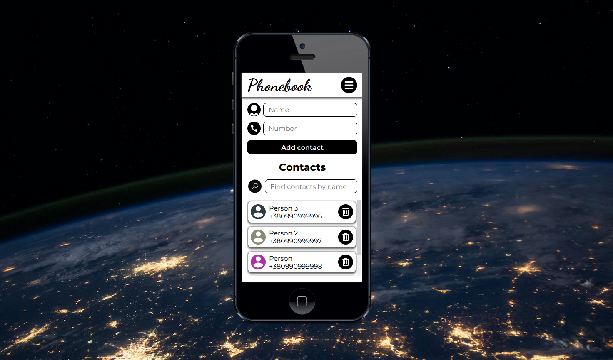

# Phonebook

## Description
* This is a pet project developed for managing contacts.
* The program allows users to register, login, update their profile, and work with a private collection of contacts.
* Connected React components with Redux logic using the react-redux library hooks. 
* Created routing with the React Router library and managed state using the Redux Toolkit library.

## Technologies
The following technologies are applied in this project:
- React
- React hooks
- Redux
- React-Redux hooks
- Redux Toolkit library
- JavaScript
- Axios
- Nanoid
- Notiflix
